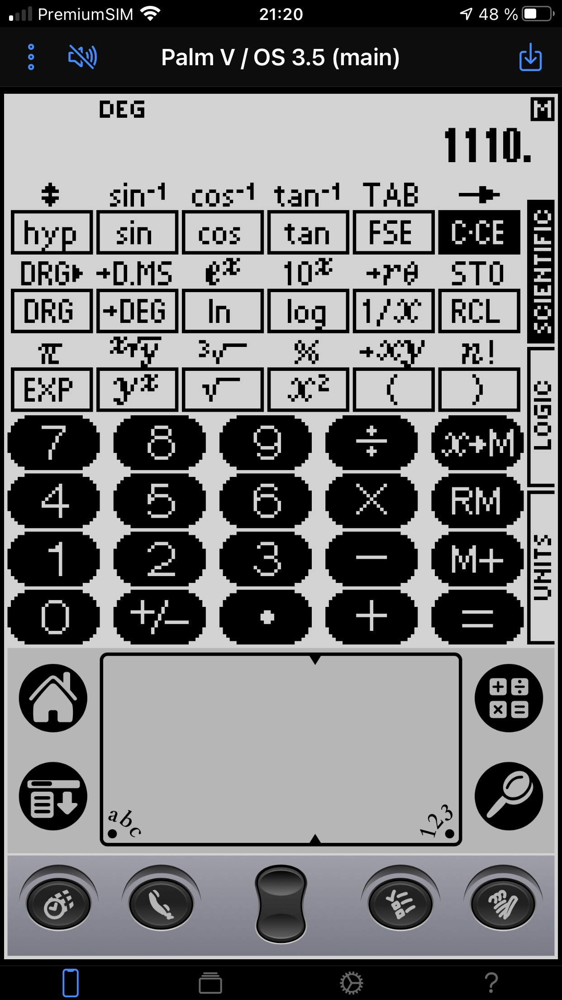
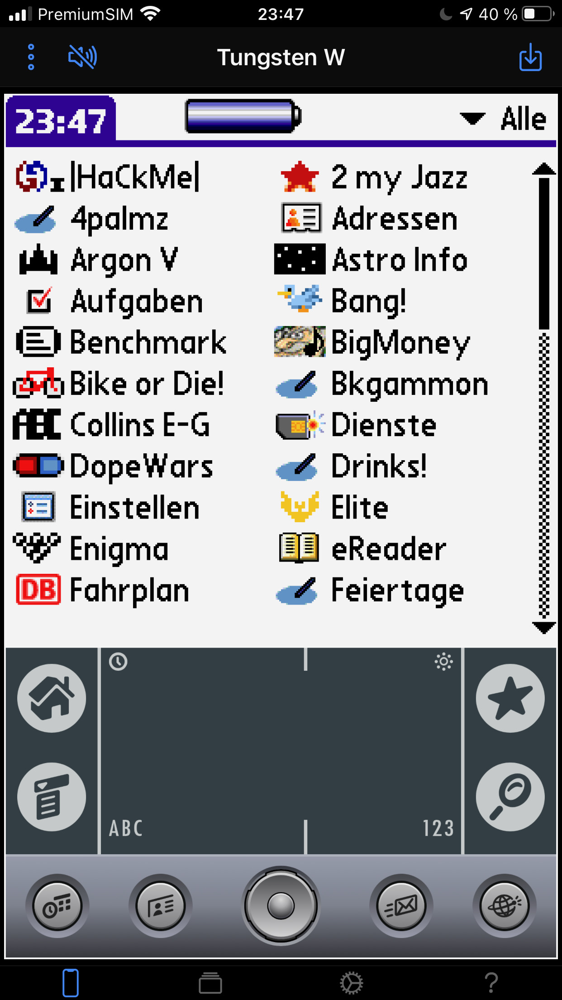

# What is this?

This is an emulator for Dragonball-based PalmOS devices that runs in a web
browser. In particular, the emulator works on iOS. The emulator is derived from
the original POSE emulator. Please see below for the list of currently supported
devices.

</img>
&nbsp;
</img>
&nbsp;
</img>

# The emulator

The current version of the emulator can be found at

https://cloudpilot-emu.github.io/app

The emulator can be added as an app to the homescreen of iOS and Android devices.
Please check out the documentation in the app.

## ROM files

In order to use the emulator you need to provide a ROM file for the device you
want to emulate. You can find a collection of ROMs [on PalmDB](https://palmdb.net/app/palm-roms-complete).

## Supported devices

The following devices are currently supported:

-   Palm IIIcc
-   Palm V
-   Palm m515
-   Palm m130
-   Tungsten W (silkscreen version)

## Other versions

A preview build of the next version of Cloudpilot is available
[here](https://cloudpilot-emu.github.io/app).

There also is a web build of the native SDL version of cloudpilot
[here](https://cloudpilot-emu.github.io/sdl)
([preview build here](https://cloudpilot-emu.github.io/sdl-preview)).
This has only a very basic interface and offers less features than the full
web app --- it is mainly a debugging tool.

# Reporting issues

Please report issues on the [Github tracker](https://github.com/DirtyHairy/cloudpilot/issues).

# Known issues

-   iOS: changing device orientation between portrait and landscape may mess
    up the layout of the app. This is an iOS bug that can be worked around by
    rotating the device by 180° in portrait and rotating back.
-   Audio timing is not perfect and processed at the refresh rate of the emulator
    (usually the same as the screen refresh rate of the host device). Sound
    effects that rely on quickly modulating the audio signal may not be
    reproduced correctly.
-   Savestates are not endian safe and can not be exchanged between big and
    little endian systems. As long as there are not big endian system that run
    Cloudpilot that issue is probably academical :)
-   On rare ocassions installing a prc or pdb can catch PalmOS on the wrong
    foot and crashes the emulator. This is particularly true if a file is installed
    on a virtual Palm IIIc with PalmOS 3.5 while the launcher is active and the
    category menu is open.
-   Trying to enable mobile on Tungsten W will crash the emulated device.

# Source code and relationship to POSE

Cloudpilot is derived from the original POSE sources. It is not a
straightforward port, though, as the original code has been adapted and partly
rewritten to fit well with a browser environment. In addition, it contains a few
bug fixes new features. In particular:

-   The codebase has been updated to build and run on both 32bit and 64bit
    little endian systems. Big endian systems should work, but I cannot test
    this (are there even any relevant big endian systems left?).
-   POSE was built as a tool for debugging and profiling PalmOS applications.
    Most of this functionality has been removed in Cloudpilot.
-   All UI parts and in particular threading were removed from the source.
-   Dispatch and timing have been partly rewritten, timing should now be pretty
    close to the original device.
-   Adjusting the grayscale in 2bpp mode works.
-   All 16MB of the Palm m515 are usable.
-   A few conditions that can cause interrupt storms have been fixed.
-   Savestate code has been rewritten to work with a fixed buffer without
    allocations.
-   Event injection works without generating null events.

# Building

The build is controlled by `src/Makefile`. You can tune the compiler and linker
options by copying `Makefile.local.example` to `Makefile.local` and editing it.

The following instructions apply to Linux and MacOS.

## Web app

### Emulator

The emulator is written in C++ and compiled to Web Assembly using emscripten. In
order to build the WASM binary you need to install a recent version of the
emscripten toolchain. Cloudpilot currently builds with 2.0.18, 2.0.15 -- 2.0.17
have a bug that breaks LTO.

With the SDK properly set up you can build the source via

```
    $ make -Csrc emscripten
```

### Javascript

The web app is written in Typescript using [Angular](https://angular.io) and
[Ionic](https://ionicframework.com). In order to build
you need [NodeJS](https://nodejs.org/en/) and [yarn](https://yarnpkg.com)
installed. Go to the `cloudpilot-ionic" directory and do

```
    $ yarn install
    $ yarn build --configuration production
```

The result will be in the `www` subdir. The build includes a service worker for
offline operation. If you don't want the service worker you'll have to delete
`ngsw-worker.js` from the generated bundle before serving it.

Note that you need to build the WASM binary (see above) before building the web
app.

## Native build

There is a simple native build for debugging Cloudpilot outside the browser. You
need SDL2 and its headers available in order to build. The build is accomplished
with

```
    $ make -Csrc bin
```

and you will up with a `src/cloudpilot` binary. The binary takes a ROM file or
session image as an argument. There is a rudemtary readline CLI with tab
completion that allows you to save session images and reset the virtual device.

## Web SDL build

The web frontend for the SDL build consists of a single `index.html`. You can serve
it directly from the git repository and the compiled WASM code is loaded from `src`
(see above).

# Credits

Artwork for Cloudpilot was done by Paolo Lazatin.

SDCTL emulation to enable the full 16MB of RAM on the m515 is taken from
[Mu](https://github.com/meepingsnesroms/Mu).

Zipfile I/O uses the [zip library](https://github.com/kuba--/zip).

# LICENSE

This program is free software: you can redistribute it and/or modify it under
the terms of the GNU General Public License as published by the Free Software
Foundation, either version 3 of the License, or (at your option) any later
version.
