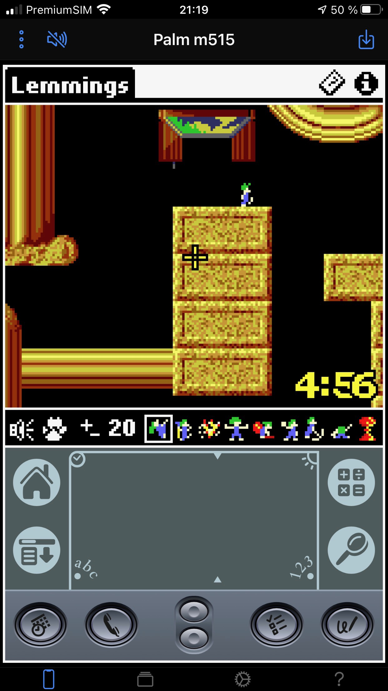
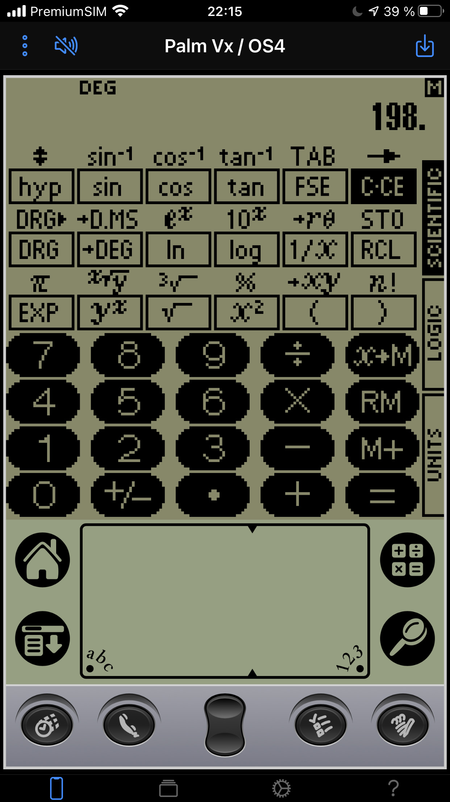
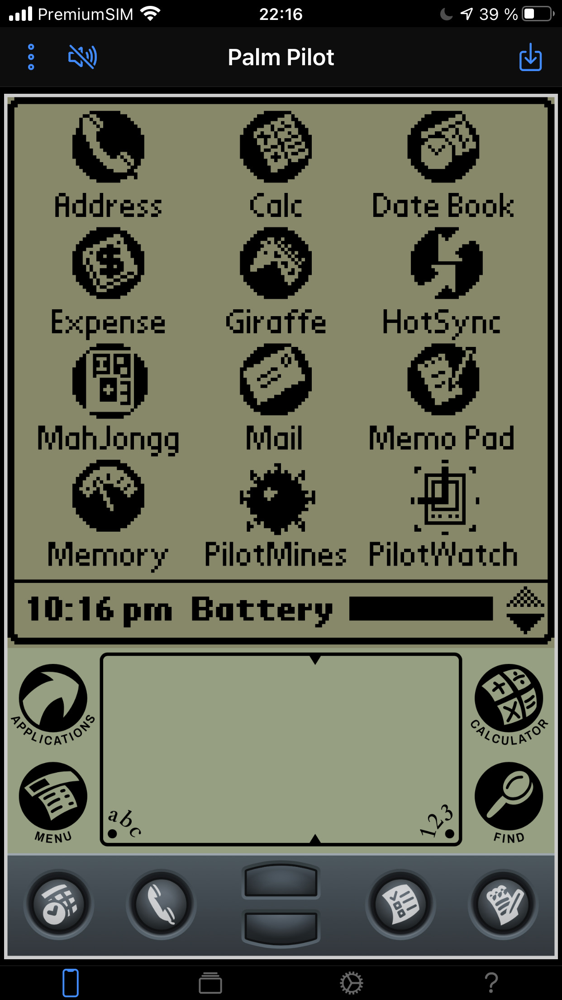

# What is this?

CloudpilotEmu is an emulator for Dragonball-based PalmOS devices that runs in a web
browser. In particular, the emulator works on iOS. The emulator is derived from
the original POSE emulator. Please see below for the list of currently supported
devices.

</img>
&nbsp;
</img>
&nbsp;
</img>
&nbsp;
</img>

# The emulator

The current version of the emulator can be found at

https://cloudpilot-emu.github.io/app

The emulator can be added as an app to the homescreen of iOS and Android devices.
Please check out the documentation in the app.

## Embedded emulator

The is an embedded version of CloudpilotEmu that allows you to embed the emulator
into your own web pages. Please check the
(documentation)[https://cloudpilot-emu.github.io/embedded/]
for more details.

## ROM files

In order to use the emulator you need to provide a ROM file for the device you
want to emulate. You can find a collection of ROMs
[on PalmDB](https://palmdb.net/app/palm-roms-complete).

## Emulated devices

The following devices are currently emulated:

-   Pilot, Palm Pilot
-   Palm III
-   Palm IIIxe, Palm IIIx, Palm IIIe
-   Palm Vx, Palm V
-   Palm VII, Palm VII EZ, Palm VIIx
-   Palm m500, Palm m505, Palm m515
-   Palm m520 (an unreleased prototype of a highres 5xx)
-   Palm m100, Palm m105, Palm m125, Palm m130
-   Palm i705
-   Tungsten W (silkscreen version)
-   Handera 330
-   Handera 330c (the lost color version of the 330c)
-   Sony PEG-S300, PEG-S320
-   Sony PEG-S500C series
-   Sony PEG-T400 series
-   Sony PEG-N600C series
-   Sony PEG-T600C series
-   Sony PEG-N700C series
-   Sony PEG-T650C series
-   Sony PEG-NR70 series
-   Acer S1x

## Other versions

A preview build of the next version of CloudpilotEmu is available
[here](https://cloudpilot-emu.github.io/app-preview).

# Reporting issues

Please report issues on the [Github tracker](https://github.com/cloudpilot-emu/cloudpilot-emu/issues).

# Known issues and limitations

-   iOS: changing device orientation between portrait and landscape may mess
    up the layout of the app. This is an iOS bug that can be worked around by
    rotating the device by 180° in portrait and rotating back.
-   Audio timing is not perfect and processed at the refresh rate of the emulator
    (usually the same as the screen refresh rate of the host device). Sound
    effects that rely on quickly modulating the audio signal may not be
    reproduced correctly.
-   Savestates are not endian safe and can not be exchanged between big and
    little endian systems. As long as there are not big endian system that runs
    CloudpilotEmu that issue is probably academical :)
-   On rare ocassions installing a prc or pdb can catch PalmOS on the wrong
    foot and crashes the emulator. This is particularly true if a file is installed
    on a virtual Palm IIIc with PalmOS 3.5 while the launcher is active and the
    category menu is open.
-   Trying to enable mobile on Tungsten W will crash the emulated device.
-   On Clié devices, audio is not emulated beyond the usual beeps.
-   External memory (CF card, SD card, memory stick) is not supported
-   Formatting an unformatted memory stick in Clié devices that run PalmOS 3.x
    locks up PalmOS.

# Source code and relationship to POSE

CloudpilotEmu is derived from the original POSE sources. It is not a
straightforward port, though, as the original code has been adapted and partly
rewritten to fit well with a browser environment. In addition, it contains a few
bug fixes new features. In particular:

-   The codebase has been updated to build and run on both 32bit and 64bit
    little endian systems. Big endian systems should work, but I cannot test
    this (are there even any relevant big endian systems left?).
-   POSE was built as a tool for debugging and profiling PalmOS applications.
    Most of this functionality has been removed in CloudpilotEmu.
-   All UI parts and in particular threading were removed from the source.
-   Dispatch and timing have been partly rewritten, timing should now be pretty
    close to the original device.
-   Adjusting the grayscale in 2bpp mode works.
-   All 16MB of the Palm m515 are usable.
-   A few conditions that can cause interrupt storms have been fixed.
-   Savestate code has been rewritten to work with a fixed buffer without
    allocations.
-   Event injection works without generating null events.
-   Reminders and alarms trigger propely.
-   Clié devices use full MQ11xx video acceleration.
-   SD card and Memory Stick emulation.

# Building

The build is controlled by `src/Makefile`. You can tune the compiler and linker
options by copying `Makefile.local.example` to `Makefile.local` and editing it.

The following instructions apply to Linux and MacOS.

## Web app

### Emulator

The emulator is written in C++ and compiled to Web Assembly using emscripten. In
order to build the WASM binary you need to install a recent version of the
emscripten toolchain. CloudpilotEmu currently builds with 2.0.24.

With the SDK properly set up you can build the source via

```
    $ make emscripten
```

### Javascript

The web app is written in Typescript using [Angular](https://angular.io) and
[Ionic](https://ionicframework.com). In order to build
you need [NodeJS](https://nodejs.org/en/) and [yarn](https://yarnpkg.com)
installed. Go to the `web` directory and do

```
    $ yarn install
    $ yarn gen-revision
    $ yarn ng run app:build:production
```

The result will be in the `www` subdir. The build includes a service worker for
offline operation. If you don't want the service worker you'll have to delete
`ngsw-worker.js` from the generated bundle before serving it.

Note that you need to build the WASM binary (see above) before building the web
app.

If you want to do development on the frontend, you can launch a live build
on `http://localhost:4200` by running

```
    $ yarn start
```

## Native build

There is a simple native build for debugging CloudpilotEmu outside the browser. You
need SDL2 and a recent version of Boost in order to build. On Ubuntu the following
will give you the necessary packages:

```
    $ apt-get install libreadline-dev libboost-all-dev libsdl2-image-dev libsdl2-dev
```

The build is accomplished with

```
    $ make bin
```

and you will up with a `src/cloudpilot` binary. The binary takes a ROM file or
session image as an argument. There is a rudemtary readline CLI with tab
completion that allows you to save session images and reset the virtual device.

# Credits

Artwork for CloudpilotEmu was done by Paolo Lazatin.

SDCTL emulation to enable the full 16MB of RAM on the m515 is taken from
[Mu](https://github.com/meepingsnesroms/Mu).

Zipfile I/O uses the [zip library](https://github.com/kuba--/zip).

Protobuf (de)serialization in C++ is done using the awesome
[NanoPB](https://github.com/nanopb/nanopb) library.

The native build uses [argparse](https://github.com/p-ranav/argparse)
and [uri-library](https://github.com/ben-zen/uri-library).
Stacktraces in the native build are based on Farooq Melas
[gist](https://gist.github.com/fmela/591333). HTTP and Websocket I/O
in the native build is done with [Boost.Beast](https://github.com/boostorg/beast).
In addition, the native build uses Boost coroutines and uuid. FAT creating,
fsck and I/O is built on [dosfstools](https://github.com/dosfstools/dosfstools)
and [FatFs](http://elm-chan.org/fsw/ff).

# LICENSE

This program is free software: you can redistribute it and/or modify it under
the terms of the GNU General Public License as published by the Free Software
Foundation, either version 3 of the License, or (at your option) any later
version.
