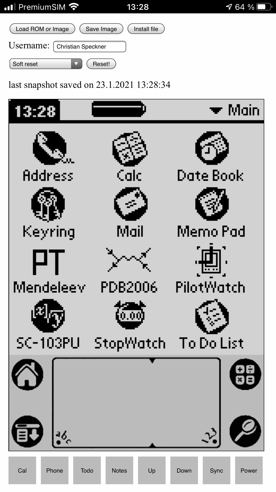

# What is this?

This is an emulator for Dragonball-based PalmOS devices that runs in a web
browser. In particular, the emulator works on iOS. The emulator is derived from
the original POSE emulator. At the moment, a Palm V device is emulated, but
support for more devices supported by POSE will follow in the future.

# The emulator

The current version of the emulator can be found at

https://dirtyhairy.github.io/cloudpilot/

The interface is currently very basic. At some point there will be a more fancy
UI that mimics a native applicaton.

</img>

## Loading a ROM and starting the emulator

In order to start the emulator you need to load a ROM file by clicking or
tapping the "Load ROM or Image" button. You need a ROM file that supports the
Palm V. After you select the ROM file the emulator will reload and start running
PalmOS.

## Keyboard input

In addition to touching or clicking the device screen you can use the keyboard
in order to enter text in the emulator.

## Installing PRC and PDB files

By clicking the "Install file" button you can select and install PRC and PDB
files into the emulated system, Note that you will have to switch launcher
categories once for a newly installed program to show up.

## Device state and page reloads

Every second the device state is saved by the emulator in the browser's
IndexedDB. When the page reloads the saved state is restored.

The timer above the emulated screen shows the time when state was last saved. As
long as the counter is black and counting everything is fine. If it turns red
but keeps counting a temporary IndexedDB error has occurred, but state is still
being saved. This is part of regular operation and can happen from time to time
i.e. when switching tabs.

If the counter turns red and stops a fatal DB error has occurred, and no state
is being saved anymore. You should reload the page at this point. If you have
unsaved data in the emulator you can save a session image (see below) before
reloading. Note that such a condition shouldn't happen and usually signfies a
browser bug, but I have seen it ocassionally on iOS

## Saving a session image

By clicking "Save Image" you can save a session image. This contains all data
and state and can be restored at any later point via "Load ROM or Image". The
session image contains the ROM, so no separate ROM file is needed in order to
restore an image.

## Changing the hotsync user name

While the emulated device can hnot hotsync, the user name was commonly used in
order to register shareware. You can change the hotsync name by entering your
name into the "Username" field.

## Resetting the device

By clicking the "Reset!" button you can reset the device. The dropdown allows
you to choose between different reset modes:

-   **Soft reset:** corresponds to pressing the reset button on a real device
-   **Reset w/o extensions:** corresponds to holding "down" while pressing the
    reset button
-   **Hard reset:** corresponds to holding "up" while pressing the reset button

## Browser compatibility

The emulator runs fine in Firefox, Chrome and in Safari, including their moble
variants. I have not tested other browsers.

**WARNING:** Since version 14 Safari has a feature that deletes all data stored
by a web page if the page isn't opened for 7 consecutive days. On iOS, you can
circumvent this by adding the page to the homescreen (see below).

## Adding the emulator to the homescreen on iOS

On iOS you can add the emulator to the honme screen. This will make sure that
your data is not discarded by the browser and removes the browser toolbar when
using the emulator.

In order to do so, tap the "Share" icon at the bottom of the browser and tap
"Add to homescreen".

Since iOS 14, saving session images from the emulator running on the home screen
works, too. After selecting "Save image" you are prompted to open the file. At
the bottom of the screen there is a "Share" icon. Tapping this allows you to
save the file instead. This does not work on iOS 13 and earlier.

## Opening a second instance in another tab

In order to preserve the integrity of the device state, only one instance of
Cloudpilot may be running with persistent state at any given time. If you start
another instance of Cloudpilot in another tab or window, the instance in the
other tab will stop saving its state in order not avoid corruption. An alert
will notify you that no more changes will be saved.

# Known issues

-   Audio is not emulated yet.
-   Attempting to install files while the virtual device is turned off will
    fail.
-   Changes to the hotsync name made while the virtual device is turned off will
    not apply.
-   The method that POSE uses to inject events into the virtual device can mess
    up the timing of games on PalmOS 3 and earlier. In particular, Lemmings is
    affected by this and runs too fast while the screen is touched. On PalmOS 4
    the emulator uses a slightly different method that does not cause this
    issue.
-   The date is not updated at midnight. It is updated from the system clock
    when the page reloads or the device resets, though.

# Source code and relationship to POSE

Cloudpilot is derived from the original POSE sources. It is not a
straightforward port, though, as the original code has been adapted and partly
rewritten to fit well with a browser environment. In addition, it contains a few
bug fixes new features. In particular:

-   The codebase has been updated to build and run on both 32bit and 64bit
    little endian systems. Big endian systems should work, but I have not tested
    this (are there even any relevant big endian systems left?).
-   POSE was built as a tool for debugging and profiling PalmOS applications.
    Most of this functionality has been removed in Cloudpilot.
-   All UI parts and in particular threading were removed from the source.
-   Dispatch and timing have been partly rewritten, timing should now be pretty
    close to the original device.
-   Adjusting the grayscale in 2bpp mode works.
-   A few conditions that can cause interrupt storms have been fixed.
-   Savestate code has been rewritten to work with a fixed buffer without
    allocations.

# Building

The build is controlled by `src/Makefile`. You can tune the compiler and linker
options by copying `Makefile.local.example` to `Makefile.local` and editing it.

The following instructions apply to Linux and MacOS.

### Emulator

The emulator is written in C++ and compiled to Web Assembly using emscripten. In
order to build the WASM binary you need to install the latest version of the
emscripten toolchain. With that in place you can build the source via

```
    $ make -Csrc emscripten
```

The frontend currently is a single `index.html`. You can serve it directly from
the git repository and the compiled WASM code is loaded from `src`.

## Native build

There is a simple native build for debugging Cloudpilot outside the browser. You
need SDL2 and its headers available in order to build. The build is accomplished
with

```
    $ make -Csrc bin
```

and you will up with a `src/cloudpilot` binary. The binary takes a ROM file or
session image as an argument. There is a rudemtary readline CLI with tab
completion that allows you to save session images and reset the virtual device.

# LICENSE

This program is free software: you can redistribute it and/or modify it under
the terms of the GNU General Public License as published by the Free Software
Foundation, either version 3 of the License, or (at your option) any later
version.
